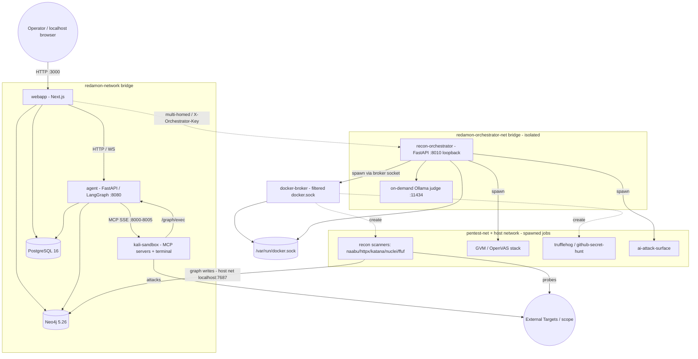
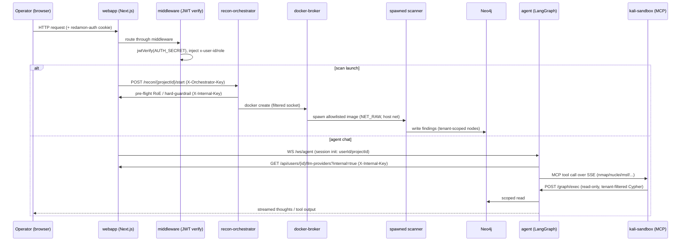
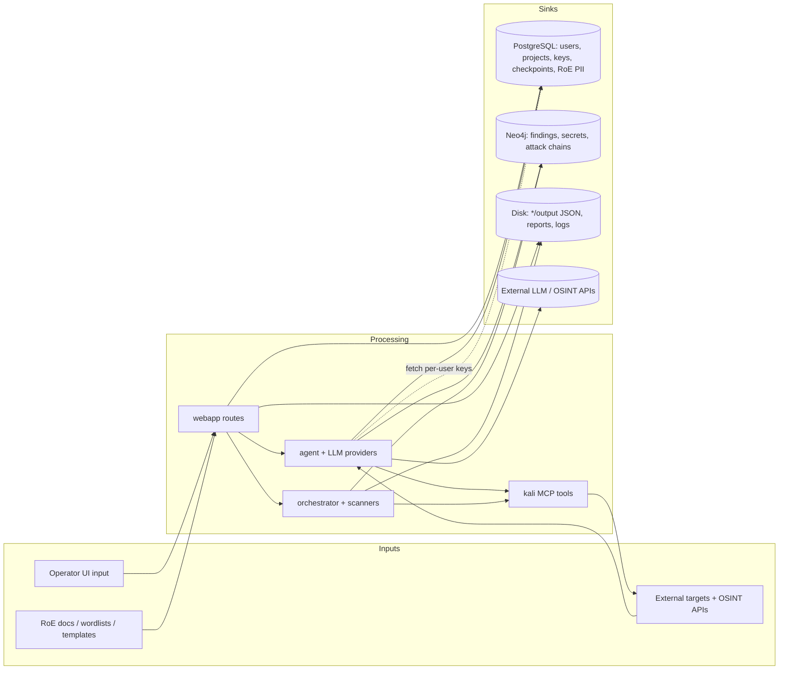
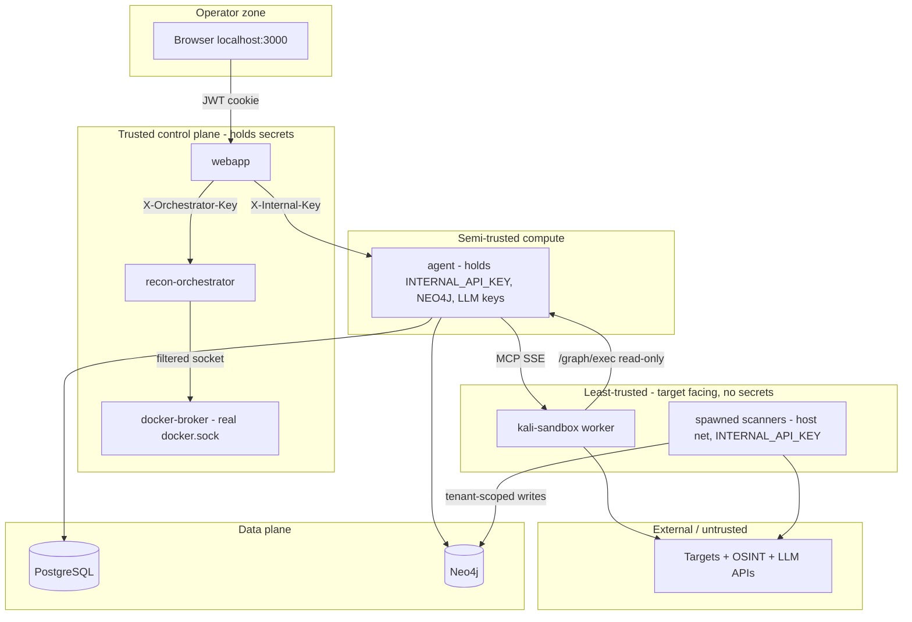

# RedAmon Threat Model

> **Scope of this document:** System overview, assets, architecture, data flow, trust boundaries, and entry points only. Vulnerability assessment and mitigation design are **out of scope** for this stage. Every statement below is grounded in repository evidence (source, Dockerfiles, `docker-compose.yml`, Prisma/Neo4j schemas, config).
>
> **Deployment assumption:** RedAmon runs **locally** (single host, Docker Compose). It is **not** intended to be exposed to the public internet. Host-published ports are reachable on the operator's machine/LAN, not from the internet.

**Project version:** 5.1.0 (`VERSION`)

## Table of Contents

1. [System Overview](#system-overview)
2. [Assets](#assets)
3. [Architecture & Data Flow](#architecture--data-flow)
4. [Trust Boundaries](#trust-boundaries)
5. [Entry Points](#entry-points)

---

## System Overview

**RedAmon** is a self-hosted, AI-driven **offensive security / red-team automation platform**. An operator defines an engagement (target scope + Rules of Engagement), launches automated **reconnaissance**, **vulnerability scanning**, and **secret hunting**, then drives an **LLM agent** (single agent or multi-agent "fireteam") that reasons over the findings and executes offensive tooling (nmap, nuclei, metasploit, hydra, playwright, ffuf, etc.) inside a sandboxed Kali container. Results are stored in a multi-tenant graph and surfaced through a Next.js web UI.

**Primary data types handled:**
- Engagement configuration and **Rules of Engagement** (target domains/IPs, scope exclusions, client contact details, time windows, allowed phases) — `Project` model, ~750 lines.
- **Reconnaissance findings** (subdomains, IPs, ports, services, technologies, endpoints, certificates, DNS) in Neo4j.
- **Discovered secrets / leaked credentials** (TruffleHog + GitHub secret hunt) stored as graph nodes and JSON artifacts.
- **Vulnerability data** (Nuclei, GVM/OpenVAS, CVE/CAPEC/MITRE enrichment).
- **Third-party credentials**: per-user LLM provider API keys and ~35 recon/OSINT service API keys.
- **Agent execution state** (LangGraph checkpoints: prompts, tool outputs, exploitation artifacts).

### Technology Stack

| Layer | Technology (evidence) |
|-------|-----------------------|
| Frontend / Web | **Next.js 16** (App Router), **React 19**, TypeScript, TanStack Query/Table, xterm.js, react-force-graph / `@xyflow/react`, Recharts (`webapp/package.json`) |
| Web auth | **JWT (HS256)** via `jose`, **bcryptjs** (12 rounds) password hashing, httpOnly cookie `redamon-auth` (`webapp/src/lib/auth.ts`, `webapp/src/middleware.ts`) |
| Relational DB | **PostgreSQL 16** via **Prisma ORM 6** (`webapp/prisma/schema.prisma`, push-based workflow) |
| Graph DB | **Neo4j 5.26 Community** + APOC plugin; bolt protocol (`docker-compose.yml`) |
| AI agent | **Python / FastAPI / Uvicorn**, **LangGraph + LangChain**, LangGraph Postgres checkpointer (`agentic/`) |
| LLM providers | OpenAI, Anthropic, Google Gemini, AWS Bedrock, OpenRouter, DeepSeek, Mistral, XAI, Qwen, GLM, Kimi, plus OpenAI-compatible / Ollama-local custom (`agentic/orchestrator_helpers/model_providers.py`) |
| Recon orchestration | **Python / FastAPI**, **Docker SDK** (`recon_orchestrator/`) — spawns scan containers |
| Offensive tooling (MCP) | **Kali sandbox** exposing **MCP servers over SSE**: network-recon, nmap, nuclei, metasploit, playwright; plus interactive terminal + tunnel manager (`mcp/servers/`) |
| Privilege separation | **docker-broker** — filtering reverse proxy for the Docker socket (`docker_broker/`) |
| Vuln scanning | **GVM / OpenVAS** (Greenbone community feed stack, `gvmd`/`ospd-openvas`) |
| Secret scanning | **TruffleHog**, **GitHub secret hunt** containers |
| AI surface testing | Local **Ollama** judge/attacker (qwen2.5:7b default), garak/PyRIT/giskard/promptfoo (`ai_attack_surface_scan/`) |
| Knowledge Base | Optional NVD / ExploitDB / Nuclei / GTFOBins / LOLBAS ingestion + embeddings (`knowledge_base/`) |
| Code remediation | LLM CodeFix/Triage agents cloning GitHub repos and opening PRs (`agentic/cypherfix_*`) |

### Deployment Architecture

All services run as containers on a single Docker host across **three bridge networks** (`redamon-network`, `redamon-orchestrator-net`, `pentest-net`) plus selected containers on the **host network**. The privileged orchestrator API is bound to **host loopback only** (`127.0.0.1:8010`).

---

## Assets

### 1. Critical Assets

| Asset | Type | Sensitivity | Impact if Compromised |
|-------|------|-------------|------------------------|
| User password hashes (`users.password`, bcrypt) | Auth data | **CRITICAL** | Operator account takeover |
| `AUTH_SECRET` (JWT signing key) | Cryptographic key | **CRITICAL** | Session forgery / full UI auth bypass |
| LLM provider API keys (`user_llm_providers`: `apiKey`, `awsAccessKeyId`, `awsSecretKey`, `awsBearerToken`) | Credentials | **CRITICAL** | Cloud/LLM billing abuse, lateral cloud access |
| ~35 OSINT/recon service keys (`user_settings`: Shodan, Censys, VirusTotal, GitHub token, FOFA, Tavily, ngrok, etc.) | Credentials | **CRITICAL** | Third-party account abuse, data leakage |
| Discovered secrets in graph (`GithubSecret`, `TrufflehogFinding`, `Secret` nodes) | Harvested credentials | **CRITICAL** | Target compromise; secondary breach |
| Neo4j credentials (`NEO4J_PASSWORD`) | DB credential | **CRITICAL** | Full read/write of all engagement findings |
| `INTERNAL_API_KEY` / `ORCHESTRATOR_API_KEY` | Service auth tokens | **CRITICAL** | Inter-service impersonation / scan orchestration |
| GitHub access token (CodeFix agent, `cypherfix_codefix/tools/github_repo.py`) | Credential | **CRITICAL** | Push/PR to operator repos |
| Rules of Engagement & client PII (`Project.roeClientContactEmail/Phone`, scope, exclusions) | Engagement data | **HIGH** | Legal/scope breach; out-of-scope attacks |

### 2. Important Assets

| Asset | Type | Sensitivity | Notes |
|-------|------|-------------|-------|
| LangGraph checkpoints (`checkpoints`, `checkpoint_blobs`, `checkpoint_writes`) | Agent state | HIGH | Hold prompts, tool outputs, exploitation artifacts |
| Recon/GVM/secret-scan JSON artifacts (`*/output/*.json`) | Scan output | HIGH | Full target metadata, vuln evidence, found secrets |
| Conversations & chat messages (`conversations`, `chat_messages`) | Engagement logs | MEDIUM | Tool outputs, agent reasoning |
| Reports (`reports`, `report_data` volume) | Generated deliverables | MEDIUM | Aggregated findings |
| Fireteam member state (`fireteam_members.resultBlob`, `errorMessage`) | Multi-agent state | MEDIUM | Exploitation results per member |
| Agent / orchestrator logs (`agentic/logs`) | Logs | MEDIUM | May contain tokens/target detail |

### 3. Infrastructure Assets

| Asset | Type | Notes |
|-------|------|-------|
| Host Docker daemon socket (`/var/run/docker.sock`) | Host control plane | Held by orchestrator + docker-broker; root-equivalent |
| Docker volumes (`postgres_data`, `neo4j_data`, `redamon_llm_models`, GVM feed volumes, `report_data`, `js_recon_*`) | Persistent storage | Hold DBs, models, uploads, reports |
| Kali sandbox container | Offensive tool runtime | Holds raw network caps (`NET_RAW`, `NET_ADMIN`), `seccomp:unconfined` |
| GVM/OpenVAS stack | Vuln scanner | `ospd` runs `seccomp/apparmor=unconfined`, `NET_ADMIN`/`NET_RAW` |
| On-demand Ollama LLM container | Local inference | Spawned per AI-surface scan; isolated net |
| Bridge networks (`redamon`, `orchestrator-net`, `pentest-net`) | Network segmentation | Trust-zone separation |

### 4. Other Assets

| Asset | Type | Notes |
|-------|------|-------|
| Uploaded wordlists (`recon/wordlists`, ≤50 MB `.txt`) | User input | Mounted into recon containers |
| Uploaded Nuclei templates (`mcp/nuclei-templates`, ≤1 MB `.yaml`) | User input | Executed by Nuclei |
| Uploaded JS recon files (`js_recon_uploads/custom`, ≤10 MB) | User input | Analyzed by JS recon |
| RoE documents (`Project.roeDocumentData` bytes; PDF/DOCX/TXT) | User input | Parsed via pdfjs/mammoth → LLM |
| Agent/community Chat Skills & Attack Skills (`agentic/skills`, `community-skills`, DB) | Behavior definitions | Steer agent tradecraft |
| Knowledge Base data (`knowledge_base/data`, `kb_data` volume) | Reference corpus | NVD/ExploitDB/Nuclei/GTFOBins embeddings |

---

## Architecture & Data Flow

### Request Flow

Operator → Next.js webapp (cookie-auth + middleware) → server-side API routes fan out to backend services with service tokens. The privileged orchestrator is reachable **only** by the webapp (loopback + dedicated network), never by the worker.

### Data Flow Diagram

Sensitive data sources, processors, and sinks identified in the repository:

**Notable flows:**
- **Per-user LLM/OSINT keys** travel webapp DB → agent at runtime via `GET /api/users/{id}/llm-providers?internal=true` authenticated with `X-Internal-Key` (`INTERNAL_API_KEY`).
- **Found secrets** flow target → secret scanners → Neo4j (`GithubSecret`/`TrufflehogFinding`/`Secret`) and `*/output/*.json` on disk.
- **Graph reads from the worker** are funneled through `agent /graph/exec`, which enforces read-only + tenant scoping; the worker holds no Neo4j credentials.
- **Outbound to external LLM/OSINT providers** carries prompts, target context, and operator-supplied keys off-host.

---

## Trust Boundaries

RedAmon implements explicit, code-level privilege separation. The design intent (documented inline in `docker-compose.yml` and `recon_orchestrator/auth.py`) is that the **target-facing worker is the least trusted** component and holds **no secrets**.

### Boundary Controls Summary

| Boundary crossing | Control observed (structural) | Residual exposure |
|-------------------|-------------------------------|-------------------|
| Browser → webapp | JWT (HS256) in httpOnly cookie; `middleware.ts` verifies + injects `x-user-id`/`x-user-role`; public-path allowlist | `AUTH_SECRET`/keys default to `changeme` if unset |
| webapp → orchestrator | `X-Orchestrator-Key`, constant-time `hmac.compare_digest`; fail-closed; orchestrator bound to `127.0.0.1` + isolated network | Single shared static key |
| webapp/agent → service APIs | `X-Internal-Key` (`INTERNAL_API_KEY`) header | Agent FastAPI endpoints (`/graph/exec`, `/emergency-stop-all`, LLM helpers) are unauthenticated; identity taken from request body |
| orchestrator → Docker daemon | **docker-broker** filters `create`: image allowlist, denies `--privileged`, host-root binds, docker.sock mount, dangerous caps/namespaces, `unconfined` | Broker is sole guard for host-root-equivalent socket |
| worker → graph | `/graph/exec` blocks write Cypher (regex) + injects `user_id`/`project_id` tenant filter; worker holds no Neo4j creds | Tenant identity is supplied, not authenticated end-to-end |
| spawned scanner → host | Host network + `NET_RAW`; mounts the **broker** socket, not raw socket; capability-restricted | Scanners do hold `INTERNAL_API_KEY` |
| platform → targets/LLMs | Hard guardrail (`.gov/.mil/.edu/.int` + ~310 intergovernmental domains, non-disableable) + LLM soft guardrail + RoE time-window pre-flight | Soft guardrail is LLM-based ("be lenient"); fails open |
| DBs | PostgreSQL/Neo4j on bridge net with credentials | Secrets stored plaintext at rest in `user_settings`/`user_llm_providers` |

---

## Entry Points

### 1. Network Entry Points

Host-published listeners (from `docker-compose.yml`). RedAmon is intended for **local use only**; bindings without an explicit `127.0.0.1` default to `0.0.0.0` and are reachable on the host LAN.

| Entry Point | Service | Protocol | Host Port | Access Control | Exposure |
|-------------|---------|----------|-----------|----------------|----------|
| Web UI / API | webapp | HTTP | `3000` | JWT cookie + middleware | LAN (0.0.0.0) |
| Agent API / WS | agent | HTTP/WS | `8090→8080` | Mixed; many endpoints unauthenticated | LAN (0.0.0.0) |
| Recon orchestrator | recon-orchestrator | HTTP | `127.0.0.1:8010` | `X-Orchestrator-Key` | **Loopback only** |
| PostgreSQL | postgres | TCP | `5432` | DB password | LAN (0.0.0.0) |
| Neo4j HTTP / Bolt | neo4j | HTTP/Bolt | `7474` / `7687` | DB password | LAN (0.0.0.0) |
| MCP network-recon | kali-sandbox | SSE/HTTP | `8000` | None (MCP) | LAN (0.0.0.0) |
| MCP nuclei | kali-sandbox | SSE/HTTP | `8002` | None | LAN |
| MCP metasploit | kali-sandbox | SSE/HTTP | `8003` | None | LAN |
| MCP nmap | kali-sandbox | SSE/HTTP | `8004` | None | LAN |
| MCP playwright | kali-sandbox | SSE/HTTP | `8005` | None | LAN |
| MSF / Hydra progress | kali-sandbox | HTTP | `8013` / `8014` | None | LAN |
| Tunnel manager | kali-sandbox | HTTP | `8015` | Push-config trigger | LAN |
| Interactive terminal WS | kali-sandbox | WS | `127.0.0.1:8016` | Init-frame tenant ctx | **Loopback only** |
| Reverse-shell / ngrok | kali-sandbox | TCP/HTTP | `4444` / `4040` | None | LAN |
| Ollama judge (on-demand) | local-llm | HTTP | `11434` | None | Spawned per scan |
| GVM (gvmd/ospd) | GVM stack | Unix socket | n/a | Socket + GVM `admin/admin` | Internal only (no host port) |

### 2. Application Entry Points

Webapp server-side routes under `webapp/src/app/api/` (all behind `middleware.ts` except the public allowlist). Authentication present unless noted.

| Route group | Examples | Auth / validation |
|-------------|----------|-------------------|
| Auth | `/api/auth/login`, `/logout`, `/me` | Public login; bcrypt compare → JWT cookie |
| Public allowlist | `/api/health`, `/api/version/check`, `/api/global/tunnel-config/sync` | **Unauthenticated by design** |
| Scan orchestration | `/api/recon|gvm|trufflehog|github-hunt|ai-attack-surface/[projectId]/*` (start/stop/status/logs) | JWT; proxied with `X-Orchestrator-Key` |
| Agent | `/api/agent/command-whisperer`, `/api/agent/sessions/*`, `/api/agent/workspace/*` | JWT; agent proxy (no auth header to agent) |
| Graph | `/api/graph`, `/api/graph-views/*` | JWT; Neo4j basic auth server-side |
| LLM / models | `/api/users/[id]/llm-providers`, `/api/models` | JWT; `?internal=true` returns **unmasked** keys |
| Settings | `/api/users/[id]/settings` | JWT; ~35 OSINT keys (masked on read) |
| Reports / analytics | `/api/reports/*`, `/api/analytics/redzone/*`, `/api/projects/[id]/reports` | JWT |
| **File uploads** | `/api/projects/[id]/wordlists` (≤50 MB `.txt`), `/api/nuclei-templates` (≤1 MB `.yaml`), `/api/js-recon/[projectId]/upload` (≤10 MB), `/api/roe/parse` (≤20 MB PDF/DOCX → LLM) | JWT; extension allowlist + `path.basename` sanitization |
| Projects | `/api/projects/*` (CRUD, import/export, presets) | JWT |

**Agent service (`agentic/api.py`) endpoints** — reachable on `:8090`; note many are **unauthenticated** and derive user/project identity from the request body:
- `WS /ws/agent` (session init), `WS /ws/kali-terminal` (PTY proxy)
- `POST /graph/exec` (read-only tenant-filtered Cypher), `POST /emergency-stop-all`
- `POST /mcp/reload|test`, `GET /mcp/manifest`, `POST /llm-provider/test`
- `POST /roe/parse`, `POST /api/report/summarize`, `POST /guardrail/check-target`
- `POST /llm/{ffuf-extensions,nuclei-tags,waf-classify,nuclei-fp-filter,takeover-classify}`
- `GET /health`, `GET /defaults`, `POST /models`, `/workspace/*`, `/sessions/*`

**Orchestrator service (`recon_orchestrator/api.py`)** — loopback `:8010`, every route except `/health` requires `X-Orchestrator-Key`:
- `POST /recon/{project_id}/{start,stop,pause,resume}`, `GET .../status,logs`, `/recon/{project_id}/partial`
- `/gvm/...`, `/github-hunt/...`, `/trufflehog/...`, `/ai-attack-surface/{project_id}/...`
- `/local-llm/{status,ensure,release}`, `DELETE /recon/{project_id}/data`, `POST /project/{id}/artifacts/{type}`

### 3. Background Entry Points

| Mechanism | Trigger | Notes |
|-----------|---------|-------|
| Spawned scan containers | Orchestrator on scan launch | Ephemeral recon/gvm/secret/ai-surface jobs via docker-broker; host network |
| On-demand Ollama judge | AI-attack-surface scan launch | Ref-counted lease; torn down at zero leases (`local_llm_manager.py`) |
| KB-refresh sidecar | `--profile kb-refresh`, opt-in | Sleep-loop scheduler: daily NVD, weekly ExploitDB/Nuclei, monthly GTFOBins/LOLBAS (`docker-compose.yml`) |
| MSF / Nuclei auto-update | `MSF_AUTO_UPDATE` / `NUCLEI_AUTO_UPDATE` env on kali boot | Pulls external content into the worker |
| Tunnel-config sync | Worker boot → webapp push to `:8015` | Worker calls unauthenticated `/api/global/tunnel-config/sync`; webapp pushes config |
| CodeFix / Triage agents | Operator-initiated remediation | Clone GitHub repo with token, run bash tool (regex-blocklist), force-push, open PR (`cypherfix_codefix/`) |
| LangGraph checkpointer | Every agent/fireteam step | Persists agent state to PostgreSQL (`PERSISTENT_CHECKPOINTER=true`) |

---

*Generated from static analysis of the RedAmon repository (v5.1.0). This document describes system structure only; threat enumeration and mitigations are deferred to subsequent threat-model stages.*
